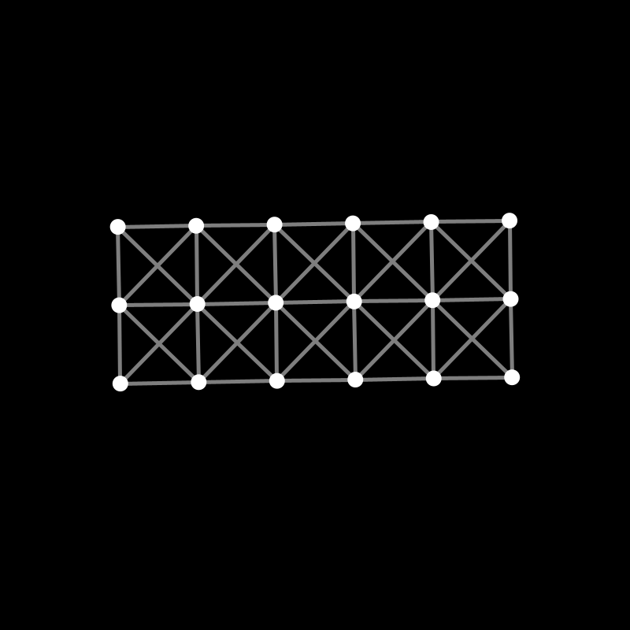
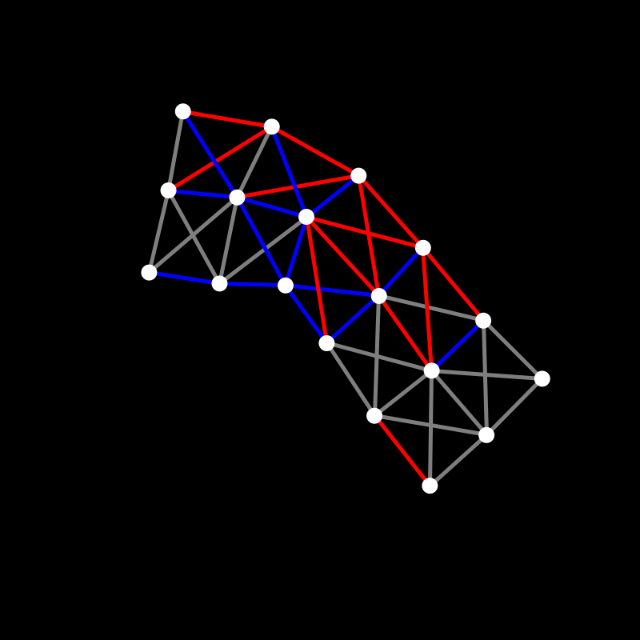
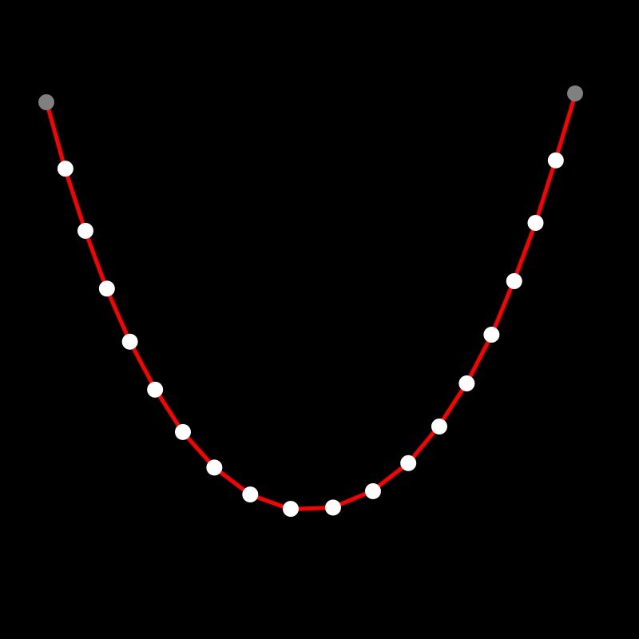
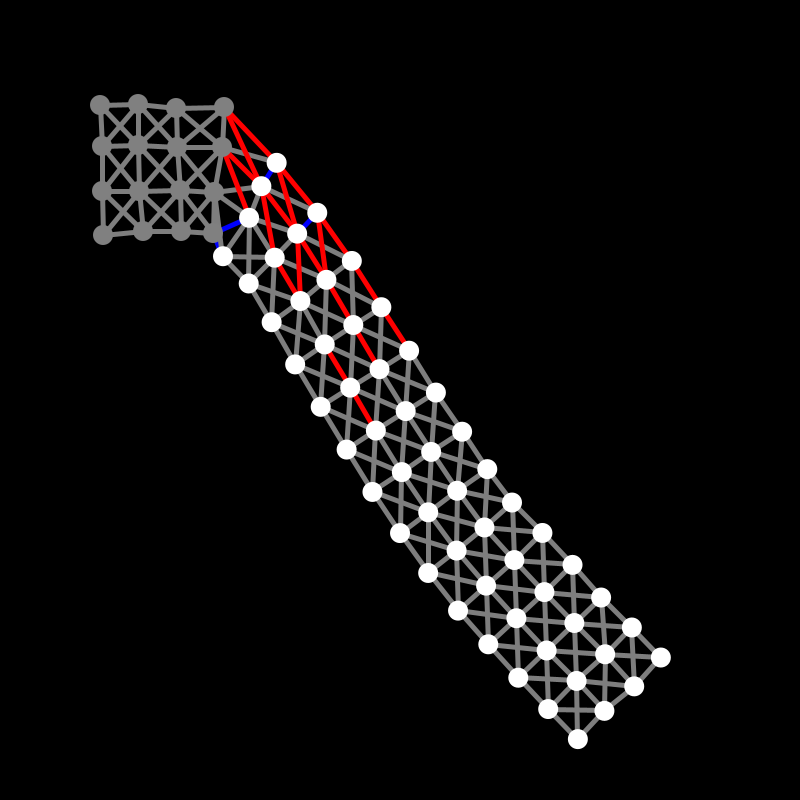
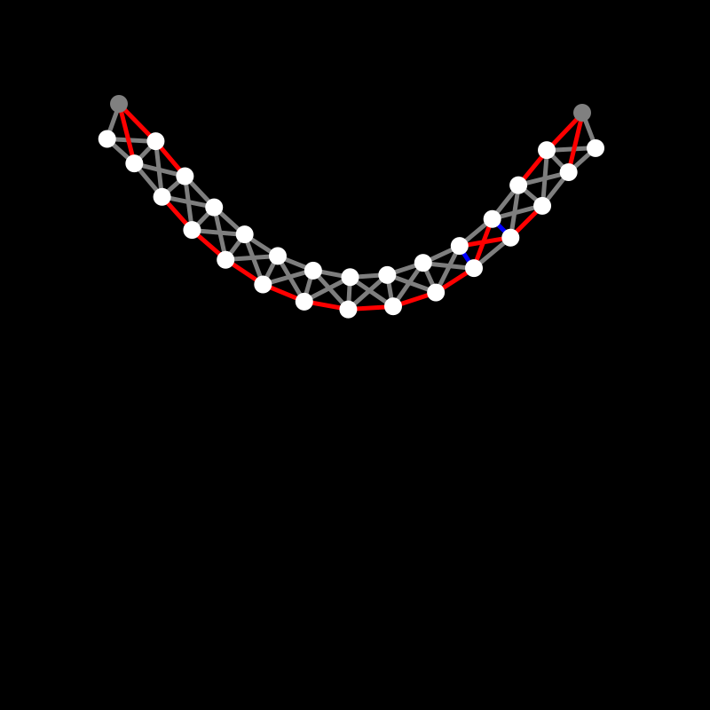

# Physics Spring Simulation

## Install

This simulation uses Processing. You can download the Processing application [here](https://processing.org/download) to run my simulation.

You can clic somewhere to grab the nearest pacticle. Another clic will ungrab the particle.
When you press a key, the selected pacticle will be lock or unlock. 

The color of a spring indicate the force it experiences. red : extende, gray : stable, blue : compressed.

## Simulation

This project use tree classes :
- A particule class
- A spring class
- A physical object class

Particules are move using Newton's laws. Particules get forces from the spring. The physical object class regroup particules and springs.

The simuation is made in different stage :
- `update` : apply force and calculate acceleration, speed and the new position
- `show` : show particules and springs

## How to use and modify

You can change the coefficient of friction.

You can create phisical object with `Obj_from_square`. You can add particule or spring with the `add` method of the physical object class.

## Quick Preview

